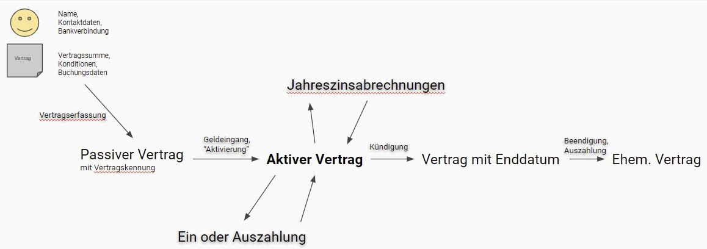
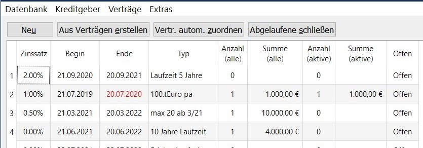
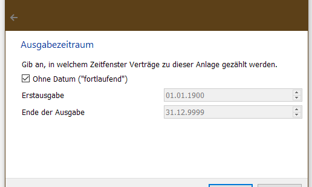
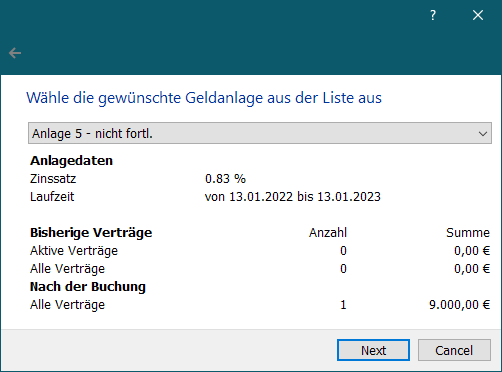
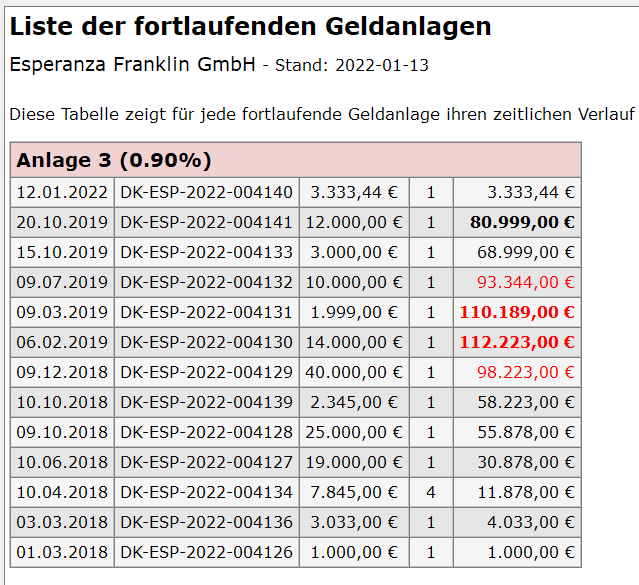

# Technische Details #

## Zinsberechnung

Die Zinsberechnung basiert auf gängigen, finanzmathematischen Grundsätzen:

- Ein Zinsjahr hat 360 Tage - jeder Zinsmonat hat 30 Tage (Methode "30/360")
- Der Vertragsbeginn ist zinsfrei, der Auszahlungstag wird verzinst
- Der (kalendarische) 31. eines Monats ist zinsfrei
- Der Februar wird mit 30 Tagen berechnet, sofern die Vertragsdauer über das Monatsende hinaus
  reicht
- Eine Zinsberechnung erfolgt zum Jahreswechsel oder bei Vertragsänderung.
- Es gibt Verträge mit unterschiedlichen "Zinsmodi" mit oder ohne Auszahlung der Zinsen am
  Jahresende. Dazu anderswo mehr\...
- Der erste Tag der Laufzeit (=Wertstellung auf dem Konto) ist zinsfrei, der letzte Tag wird
  verzinst.

## Lebenszyklus eines Vertrags

- Der Kreditgeber und ein Projektmitglied füllen den Vertrag bis auf die Kennung vollständig aus und
  reichen ihn unterschrieben bei den Geschäftsführern (GF) zur Unterschrift ein
- Nach Unterschrift geben die GF die Vertragsunterlagen an die DK Verwaltung (DKV). Falls notwendig
  wird der DK Geber angelegt und dann der Vertrag erfasst. Dabei wird die DK Kennung vergeben und
  auf den Vertragsformularen vermerkt
- Ein Satz der Unterlagen wird an den DK Geber zurück geschickt, einer für die Projekt GmbH
  abgelegt.
- Der Geldeingang wird von den GF an die DKV gemeldet: der Vertrag wird in DKV2 "aktiviert". Damit
  beginnt die Zinsberechnung
- Sollte kein Geldeingang erfolgen, so kann der Vertrag gelöscht werden
- Zu aktiven Verträge können Ein- oder Auszahlungen gemacht werden.
  - Dabei werden der "minimale Vertragswert" und der "minimale Auszahlungsbetrag"
    berücksichtigt: Es können keine Buchungen gemacht werden, durch die ein Vertrag oder eine
    Abbuchung entsteht, die zu klein ist.
  - Zum Zeitpunkt einer Ein- oder Auszahlung wird eine Zinsabrechnung durchgeführt. Dieser so
    errechnete "Zwischenzins" wird - unabhängig vom Zinsmodus - immer auf den Vertrag angerechnet.
- Zum Jahreswechsel wird ein "Jahresabschluss" durchgeführt: Dabei werden die angelaufenen Zinsen
  berechnet und bei thesaurierenden Verträgen zum Wert des Vertrages aufaddiert. Für auszahlende
  Verträge muss die Auszahlung veranlasst werden.
- Wird der Vertrag gekündigt, errechnet das Programm bei Verträgen mit Kündigung das Vertragsende
  und speichert den Vertrag dann als Vertrag mit festem Vertragsende
- Verträge mit festem Laufzeitende können beendet werden. Das Programm berechnet dann die
  auszuzahlende Summe aus Kreditbetrag und Zinsen.

## Zins Auszahlungsmodi

### Thesaurierende Verträge

- Bei thesaurierenden Verträgen wird der Zins der durch die Jahreszinsabrechnung anfällt, auf den
  Vertragswert aufaddiert und im nächsten Jahr mit verzinst.
- Es müssen also zum Jahreswechsel keine Auszahlungen gemacht werden
- Der Wert des Vertrages wächst über die Zeit exponentiell.

### Auszahlende Verträge

- Bei auszahlenden Verträgen werden die Zinsen der Jahresabrechnung in der ersten Kalenderwoche des
  Folgejahres ausgezahlt, das heißt auf das Konto der Kreditgeber\*in überwiesen.
- Für Überweisungen können - abhängig von der Bank - Gebühren anfallen
- Der Wert des Kredits bleibt konstant

### Kredite mit festem Zinsbetrag

- Die Zinsen werden am Jahresende nicht ausgezahlt aber auch nicht weiter verzinst. Sie verbleiben
  bei dem Projekt
- Erst am Vertragsende werden Kreditbetrag UND Zinsen ausbezahlt.
- Dieser Zinsmodus ist unüblich, aber für das Projekt vorteilhaft.

### Kredite ohne Zins

Seit Version 0.0.0.12 werden solche Verträge mit einem eigenen Zinsmodus verwaltet. Wer mit älteren
Versionen Verträge angelegt hat, die 0% Zinsen haben sollte daher Änderungen an der Datenbank
manuell nachziehen (ggf. bei mir nachfragen)

Zinsen, die bei Ein- oder Auszahlungen anfallen werden immer auf den Vertragswert angerechnet und
nicht ausbezahlt. Möchte ein Kreditor über solche Zinsen verfügen, so muss eine weitere Auszahlung
gebucht werden

## Zins Berechnungsmodi

Zinsen werden immer "pro Jahr" angegeben. Wenn man sagt, für einen Kredit würden 2% gezahlt sind
damit 2% der Kreditsumme pro Jahr gemeint.  Wie geht man aber mit dem Anfang und Ende des Vertrags
um, wenn dieser nicht mit dem Zins Jahr (bei DKV2: Kalenderjahr) übereinstimmt? Es gibt mindestens
4 - vermutlich noch mehr - Methoden, das zu berücksichtigen.  DKV2 kann (ab Version 17.2) zwei davon
umsetzten:

### Die "alte" 30/360 Methode

Diese Methode verwendet ein vereinfachtes Modell des Kalenderjahres:

- Schaltjahre und "normale" werden gleich behandelt
- Alle Monate werden gleich behandelt so als hätten sie 30 Tage
- Das Jahr hat demnach 360 Tage und demnach wird für jeden Tag
    1/360tel des Jahreszinses bezahlt (also 0,002777778)
- Daraus folgt, dass für jeden Monat der gleiche Zins bezahlt wird
    (1/12tel des Jahreszinses). Bei der Berechnung erreicht man das,
    indem man bei einer Zinsberechnung, die an einem 31. endet den
    gleichen Zins bezahlt, als wenn sie am 30. geendet hätte.

### Die jüngere Methode "act / act"

Das kommt vom englischen "actual" für "tatsächlich". Gemeint ist
damit, dass die tatsächlichen Tage pro Monat und tatsächlichen Tage pro
Jahr berücksichtigt werden. Das klingt gut - und ist bei der Verwendung
von Computern auch ganz leicht, aber es hat ein paar interessante
Effekte:

- Schaltjahre haben ja 366 Tage - der Zinsanteil pro Tag beträgt also
    1/366tel (0,00273224). Alle anderen Jahre haben nur 365 Tage, so
    dass pro Tag 1/365tel (0,002739726) bezahlt wird. Ein Tag ist also
    nicht immer gleich viel wert.

- Beide Zahlen sind kleiner, als das 1/360tel, das in der anderen
    Methode bezahlt würde. Hier werden also - im Gegensatz zur 30/360er
    Methode - alle Tage berücksichtigt, aber dafür wird jeder Tag ein
    bisschen schlechter bewertet. Daher kommt es, dass die Unterschiede
    der beiden Methoden vernachlässigbar klein sind.

- Natürlich gelten in diesem Modell Vereinfachungen wie "in einem
    halben Jahr bekommt man den halben Zins" oder "in einem Monat
    bekommt man 1/12 des Zins" nicht. Schließlich lässt sich 365 weder
    durch 2 noch durch 12 teilen.

Zu guter Letzt: Warum sind die Unterschiede nur für das Anfangs- und das
End Jahr relevant? Weil in jedem vollständig ausbezahlten Jahr der volle
Zins bezahlt wird: einmal 360/360tel, im anderen Falle 365/365tel bzw.
366/366tel - also immer der volle Zins.

### Die Umsetzung in DKV2

Vor der Versionen 17.2 wurde immer die 30/360er Methode verwendet. Mit
der neuen Version kann man beim anlegen einer neuen Datenbank den
Zinsmodus auswählen. Die Methode kann (natürlich) im Nachhinein nicht
mehr geändert werden und gilt für alle Verträge der Datenbank.

In der Statuszeile - wo bisher nur der Dateiname der aktuellen Datenbank
stand - wird jetzt auch die Zinsmethode der Datenbank angezeigt.

## Jahreszinsabrechnung

Mit dieser Funktion werden die Zinsen zu allen Verträgen zum
Jahreswechsel berechnet.

Zunächst rechnet DKV2 aus, zu welchem Jahr eine Zinsabrechnung erfolgen
kann. Es ist das älteste Jahr, zu dem es einen Vertrag gibt, für den
nach seiner Aktivierung oder anderer Buchungen noch keine Zinsabrechnung
gemacht wurde. Nur für dieses Jahr kann eine Abrechnung gemacht werden.
Es wird zur Abrechnung vorgeschlagen:

Thesaurierende, auszahlende Verträge und Verträge mit festem Zinsbetrag
werden bei der Jahreszinsabrechnung unterschiedlich behandelt (siehe
"Zinsmodi").

Das Ergebnis der Abrechnung kann als Liste in einer (.CSV) Datei
ausgegeben werden. Mit dieser Datei können die üblichen Büro Programme
(Microsoft Office, OpenOffice, LibreOffice) mit Hilfe der
Tabellenkalkulation (Excel, Calc, \...) und Textverarbeitung (Word,
Writer) und der "Serienbrief" Funktion können so leicht Briefe für die
Kreditgeber\*innen erstellt werden.

## Befehlszeile

Beim Aufruf des Programms kann der vollständige Pfad zu einer Datenbank
angegeben werden. So kann man mehrere Verknüpfungen erstellen, die
jeweils DKV2 aufrufen und mit unterschiedlichen Datenbanken öffnen.

## Datenbank Versionierung

In der Tabelle `Meta` speichert DKV2 Konfigurationsinformation wie
zum Beispiel Projektdaten. Dort gibt es 2 Einträge die helfen die
Veränderung der Datenbank im Lauf der Entwicklung zu unterstützen.

Unter dem Namen `Version` ist eine Zahl abgelegt, die DKV2 bei jedem
Start prüft. Öffnet eine neue Version eine alte Datenbank (also mit
einer Version die kleiner ist, als die die das Programm erwartet) nimmt
DKV2 eine Konvertierung vor: Es wird eine Datenbank im neuen Format
angelegt und alle Daten werden dann von der alten in die Neue Datenbank
kopiert. Die Kopie hat am Ende den gleichen Namen, wie die ursprüngliche
Datei. Die alte Datei wird als Kopie in dem gleichen Ordner gespeichert.
Diese Kopie hat `*.preconversion*` und ein paar zufällige Zeichen an
den Dateinamen angehängt.

Auf diese Weise können im Laufe der Entwicklung Tabellen Felder ergänzt
oder verändert werden. Zumindest solange sich die Daten kompatibel in
das neue Format kopieren lassen.

Eine Manipulation der Einträge in der `Meta`-Tabelle kann natürlich zu
Problemen führen und sollte unterbleiben.

## Datenbank Views

*Views* sind Elemente in einer Datenbank die dabei helfen komplizierte Abfragen durchzuführen und
verringern den Programmieraufwand im Programm. Im Laufe der Entwicklung von DKV2 ändern sich die
Views immer wieder. Damit die Views in einer Datenbank immer zum aktuellen Programm passen, gibt es
folgenden Mechanismus:

In der Tabelle `Meta` ist ein Feld mit dem Namen `dkv2.exe.Version`. In diesem Feld "merkt" sich
DKV2 mit welcher Programmversion die Datenbank zuletzt geöffnet wurde. Stimmt die Version nicht mit
der aktuellen Version überein, so werden alle Views gelöscht und neu geschrieben.

## Geldanlagen

"Geldanlagen" sind eine Methode, um die Direktkredit Verträge in
Gruppen einzuteilen und das Volumen und die Anzahl der Verträge im Blick
zu behalten. Um nicht der Prospektpflicht zu unterliegen ist es
nützlich, wenn das Volumen bzw. die Anzahl der Verträge bestimmte
Grenzen unterschreiten.

In DKV2 hat eine Geldanlage eine Laufzeit (Start- und Ende Datum), einen
bestimmten Zinssatz und einen "Typ" (also einen beliebige
Bezeichnung). In der Übersicht werden zusätzlich die Anzahl der
Verträge, die der Geldanlage zugeordnet sind und das Volumen dieser DK
angezeigt. Anzahl und Volumen werden zusätzlich noch beschränkt auf
bereits aktive Verträge angezeigt.

In der letzten Spalte der Übersicht steht, ob eine Anlage "Offen"
ist - ob also die Geldanlage beim erstellen eines Vertrages zur Auswahl
angeboten wird.

Folgende Funktionen werden durch Knöpfe über der Übersicht angeboten:

**Neu** - damit wird einen neue Geldanlage angelegt

**Aus Verträgen erstellen** - Diese Funktion geht durch alle Verträge,
die noch keiner Geldanlage zugeordnet sind und prüft, ob es eine
Geldanlage gibt, in die der Vertrag nach Zeitraum (Vertragsdatum) und
Zinssatz passt. Wenn es keine passende Geldanlage gibt, so wird eine
erstellt.

**Vertr. autom. zuordnen** - Diese Funktion geht durch alle Verträge,
die noch keiner Geldanlage zugeordnet sind und prüft ob es genau eine
Geldanlage gibt, in die der Vertrag nach Zeitraum und Zinssatz passt.
Ist das der Fall, so wird der Vertrag der Geldanlage zugeordnet. Meist
führt man diese Funktion aus, nachdem neue Anlagen z.B. durch "Aus
Verträgen erstellen" angelegt worden sind.

**Abgelaufene schließen** - diese Funktion geht durch alle offenen
Geldanlagen und schließt sie, falls das "Ende" Datum des Vertrags
bereits in der Vergangenheit liegt. Geschlossene Anlagen werden bei der
Erstellung von Verträgen nicht mehr angeboten.

**Kontext Menü**

Über das Kontext Menü kann man Geldanlagen löschen oder ihren Bezeichner
ändern. Außerdem kann man den sie schließen oder öffnen.

## Fortlaufende Geldanlagen

Bei fortlaufenden Geldanlagen gibt es kein Anfangs- oder Enddatum. Sie
unterscheiden sich nur im "Typ" - also in ihrem Bezeichner. Das
Projekt erfüllt in diesem Modell die "100.000er Regel" indem beim
Abschluss jedes Kreditvertrags dafür gesorgt wird, dass - einschließlich
des neuen Vertrags - in den 12 Monaten vor dem Abschluss weniger als
100.000 Euro in der gleichen Anlage ausgegeben wurden.

- Anlegen solcher Geldanlagen funktioniert in DKV2 auf der Seite
    "Verträge -\> Anlagen verwalten" mit dem Schalter "Neu". Der
    Dialog für das Datum hat jetzt ein Schaltkästchen mit dem Text
    "Ohne Datum ("fortlaufend") (s. unten)

- Beim Anlegen eines Vertrags wird in der Auswahl der Geldanlage die
    Summe der Anlage aus den letzten 12 Monaten angezeigt (s. unten)

- Es gibt 2 "Übersichten" unter "Verträge -\> Übersichten", die
    für die fortlaufenden Geldanlagen aufzeigen, ob zu jedem Zeitpunkt
    die 100.000er Regel eingehalten wurde. Eine ist nach der Zeit, die
    zweite pro Anlage organisiert. Steigt die Summe einzelner Anlagen,
    so werden sie farblich hervorgehoben. (s. unten)

## Projektkonfiguration

Im Menü "Datenbank" kann man über die Option "Projektkonfiguration"
zahlreiche Einstellungen ändern. Hier ein Überblick:

Adresse, URL zur Webseite und E-Mailadresse werden für den Briefdruck
verwendet. Ebenso die Gefü und das zuständige Amtsgericht und den
Handeslregister Eintrag.

Bei "DK Verwaltung" sollte der Name der Bearbeiter\*in der DK /
Verfasser\*in der Briefe genannt werden.

Unter **"Weitere Konfituration"** gibt es:

**"Kleinster Auszahlungsbetrag in Euro"** - Da Überweisungen oft mit
Kosten verbunden sind, kann man hier konfigurieren, welche der minimale
Betrag ist, der als "Auszahlung" gemacht werden kann.

**"Kleinster Vertragswert in Euro"** - Hier wird der kleinste Betrag
konfiguriert, über den ein Vertrag angelegt werden kann. Eine
Auszahlung, durch die der Vertrag unter diese Schwelle fallen würde,
wird ebenfalls verhindert.

**"Größter auswählbarer Zins \... "** - Hiermit wird die Länge der
Liste der Zinssätze beim Anlegen eines Vertrages beschränkt.

Die Werte **"Anzahl von Verträgen \..."** und **"Summe aller Verträge
\..."** beziehen sich auf Geldanlagen. Werden die genannten Grenzen
überschritten, so werden die Geldanlagen in der Übersicht der
Geldanlagen sowie beim Erstellen von Verträgen in Rot gekennzeichnet.

## Jahresendbriefe

Im Menü "Verträge" -\> "Listen drucken" gibt es jetzt die Option "Zinsbriefe".

Sie öffnet einen Dialog, der abfragt, zu welchem Jahr die Zinsbriefe ausgegeben werden sollen. Nach
Auswahl des Jahrs und Bestätigung werden im konfigurierten Ausgabeverzeichnis verschiedene Dateien
und Verzeichnisse erzeugt.

- Der Name der Dateien hat die Form `Jahresinfo \<Datum\>\_\<Name\>.pdf`.
- In den Briefen wird ein Logo mit ausgegeben. Ihr müsst Euer Logo als
    png Datei mit dem Namen "brieflogo.png" in den Unterordner
    "vorlagen" Eures Ausgabeverzeichnisses legen. Die Vorlage ist auf
    300x150 px optimiert.
- Um einen einzelnen Brief zu verändern:
  - In dem Unterverzeichnis "html" liegen die gleichen Briefe in HTML Format - falls man die
    einzelnen Briefe zunächst erst editieren möchte. Das könnte zum Beispiel der Fall sein, wenn
    eine Anrede "Liebe\*r" keinen Sinn ergibt. Nach dem Editieren kann aus dem Browser heraus nach
    pdf "gedruckt" werden (WINDOWS), um auch die geänderten Briefe in pdf zu erhalten.
- Um alle Briefe zu verändern:
  - Im Verzeichnis "vorlagen" liegt die html und css Datei, auf der die Ausgabe beruht. Werden
    diese Dateien verändert und die gleiche Option erneut ausgeführt, so werden alle PDF neu und auf
    der geänderten Vorlage beruhend, ausgegeben. So können projektspezifische Änderungen für alle
    Briefe erreicht werden.
